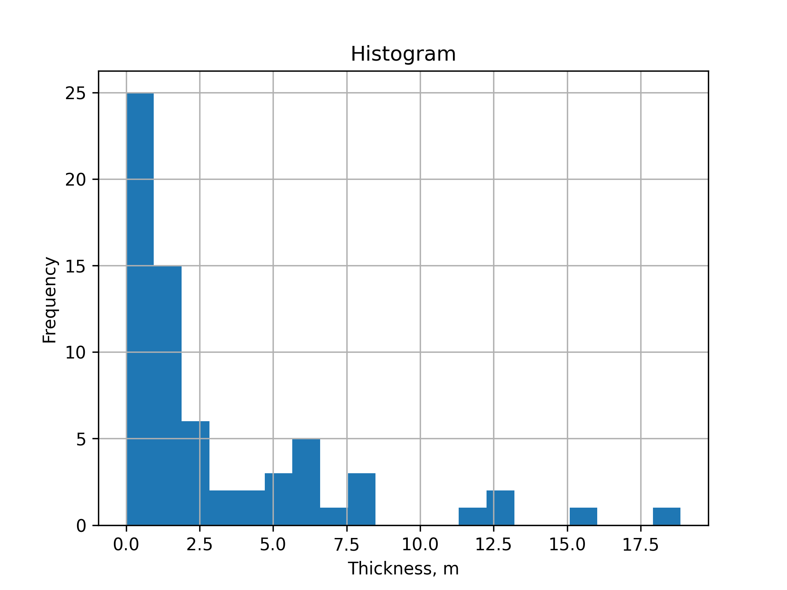
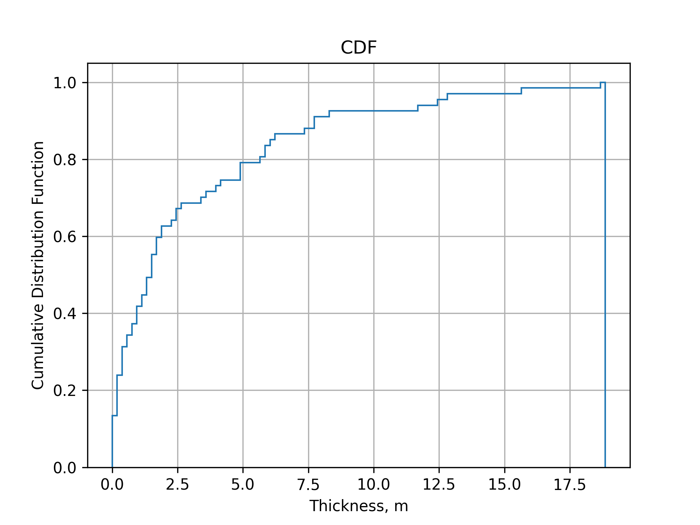
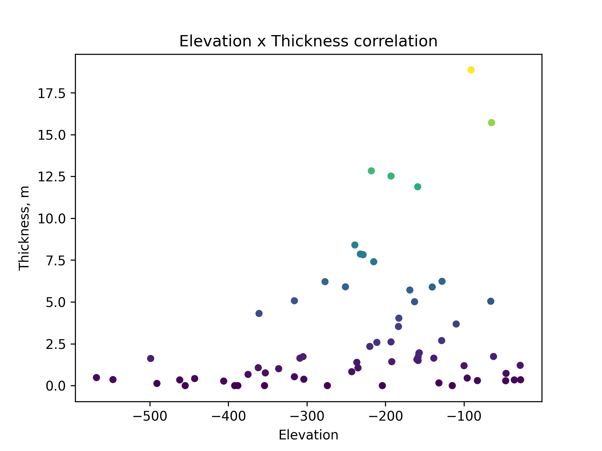
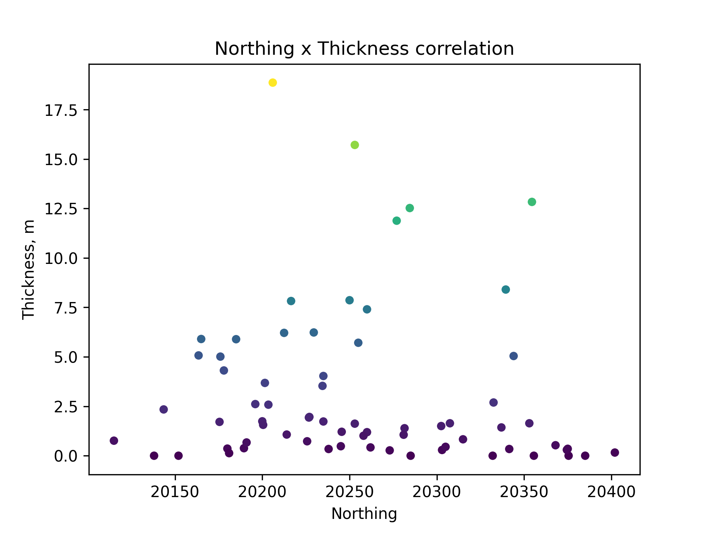
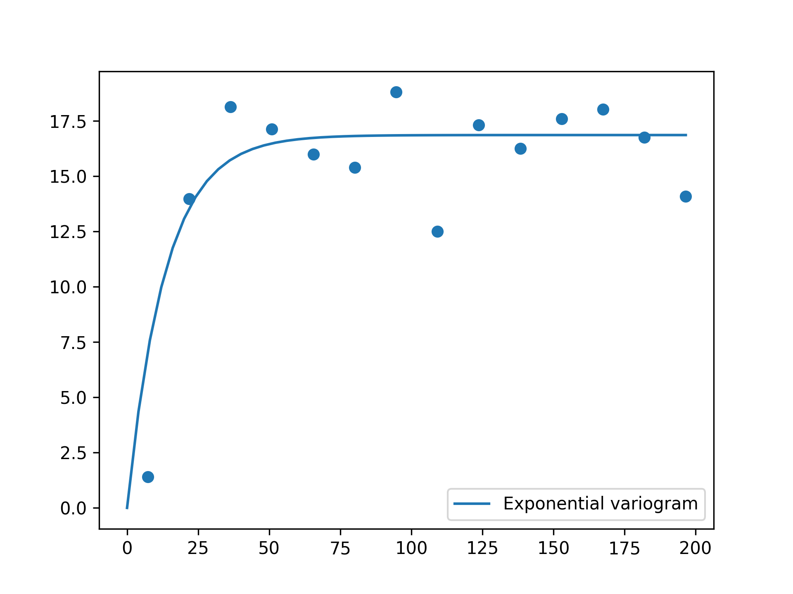
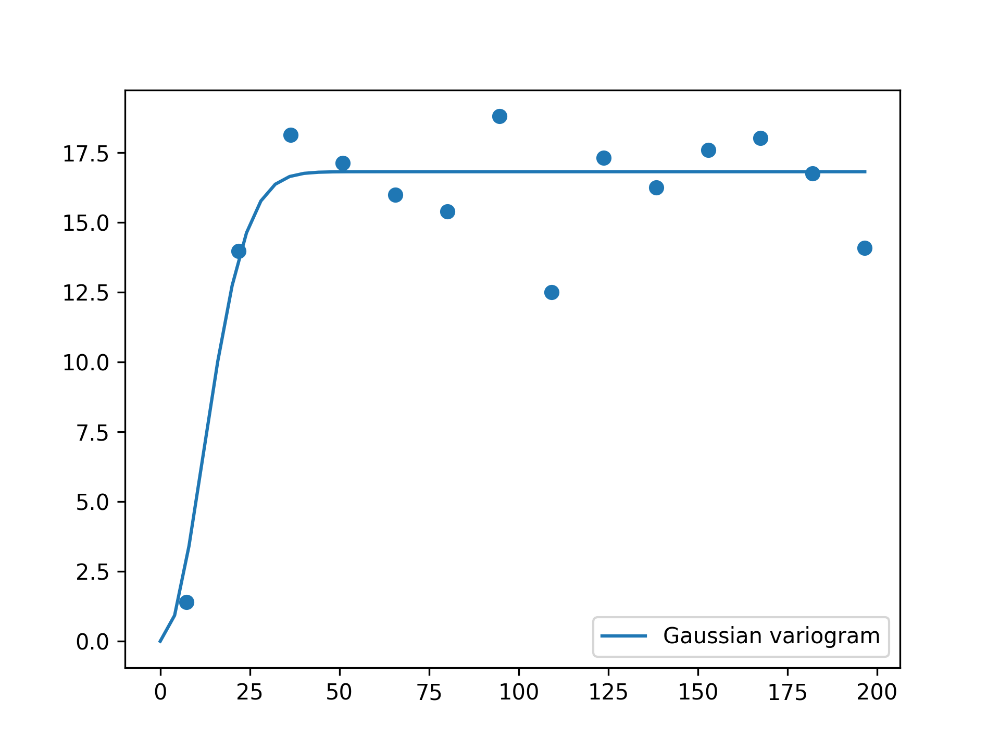

---
title:
- Assignment 7 report for MIN E 612
author:
- Átila Saraiva Quintela Soares
date:
- \today
---

Code to generate the results can be found on the github repository [https://github.com/AtilaSaraiva/learning_variogram_and_stuff](https://github.com/AtilaSaraiva/learning_variogram_and_stuff/blob/assignment7/src/Assignment%207.ipynb)

# Question 1

First of all, the samples are laid out as shown in Figure 1.


To do the EDA, I chose to first check the distribution of thickness plotting a histogram on Figure 2 and the cumulative density distribution on Figure 3. It can be seen that there is a much higher frequency of lower thickness, with a few ocurrences of thick data. This might imply that the large thickness samples might be sparse among the other samples.





Afterwards, I tried to check for the correlation between the thickness and the spatial variables, which can be seen in the Figure 3 and 4. The correlation coeficients are as follows:

| Type                  | R²       |
| --------------------- | -------- |
| Elevation x Thickness | 0.2724   |
| Northing x Thickness  | \-0.0885 |

It can be seen from both the scatter plots in Figure 4 and 5 and from the table above that the correlation is higher in relation to the elevation.






# Question 2

In Figures 6 to 8 the non standardized experimental variogram is shown on top of three models respecively, the spherical, exponential and Gaussian. From the variograms it can be seen that the variograms are unstable, having a lot of noise. I tried different lag scales but these are the best results I found through trial and error and automatic optimization.
Nevertheless, for all models the range is small, indicating a certain lack of spatial continuity.

The parameters I used for the models are as follows:

```python
Spherical(sill=16.8, lag_scale=36.0, nugget=1.54e-13)
Exponential(sill=16.9, lag_scale=13.4, nugget=7.34e-24)
Gaussian(sill=16.8, lag_scale=14.9, nugget=7.66e-19)
```






# Question 3

The cross validation method proposed in class used GSLIB to plot the correlation between the estimated and true thickness values at the sample points. Hence, to find the optimal options, like different models or krigging methods, I would normally have redo the estimations and plot the correlation again, aiming to find the highest correlation.

To avoid this trial and error, I decided to use a library called PyKrige to do theautomatic optimization using cross validation for the parameters that I pass down to it. In this snippet of code bellow I am setting up the program to vary the krigging methods and the three variogram models I used.

```python
from pykrige.rk import Krige
from sklearn.model_selection import GridSearchCV

param_dict = {
    "method": ["ordinary", "universal"],
    "variogram_model": [sph_model, gauss_model, exp_model],
}

estimator = GridSearchCV(Krige(), param_dict, verbose=True, return_train_score=True)

X = np.array((x,y)).T
print(X.shape)
estimator.fit(X=X, y=thickness)
```

Here are the results from the cross validation:

```
best_score R² = -0.078
best_params =  {'method': 'universal', 'variogram_model': Exponential(dim=2, var=16.9, len_scale=13.4, nugget=7.34e-24)}

CV results::
 - mean_test_score : [-0.28853257 -0.32909833 -0.24239532 -0.08417891 -0.11726218 -0.07811195]
 - mean_train_score : [1. 1. 1. 1. 1. 1.]
 - param_method : ['ordinary' 'ordinary' 'ordinary' 'universal' 'universal' 'universal']
 - param_variogram_model : [Spherical(dim=2, var=16.8, len_scale=36.0, nugget=1.54e-13)
 Gaussian(dim=2, var=16.8, len_scale=14.9, nugget=7.66e-19)
 Exponential(dim=2, var=16.9, len_scale=13.4, nugget=7.34e-24)
 Spherical(dim=2, var=16.8, len_scale=36.0, nugget=1.54e-13)
 Gaussian(dim=2, var=16.8, len_scale=14.9, nugget=7.66e-19)
 Exponential(dim=2, var=16.9, len_scale=13.4, nugget=7.34e-24)]
```

# Question 4

Using a block of size 10 x 10 given the domain of the sampled data, I used the optimal options from the cross validation to perform a krigging shown on Figure 9. The krigging method used was simple krigging with the exponential model.


