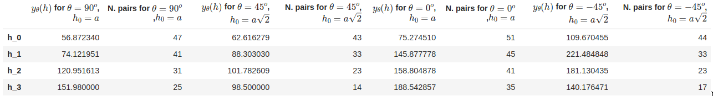
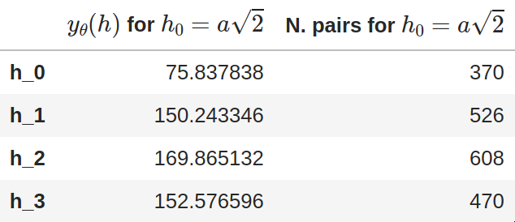

---
title:
- Assignment 4 report for MIN E 612
author:
- Átila Saraiva Quintela Soares
date:
- \today
---

Code to generate the results can be found on the github repository [https://github.com/AtilaSaraiva/learning_variogram_and_stuff](https://github.com/AtilaSaraiva/learning_variogram_and_stuff/blob/fff8841c758a461fbd223c40c46c5b8fea1df236/src/assingment.ipynb)

# Question 1

Taking into account that the semivariogram is given by:
$$\gamma(h) = \frac{1}{2} E\{ ( Z(\mathbf{u}) - Z(\mathbf{u} + \mathbf{h}) )^2\}$$
I wrote some code to make the plots and the table by calculation the variogram. The way that I've done is assuming a irregular grid, and checking if the each point if they are in a certain direction and lag in reltion to a sample point, and then I repeated the process for each sample to make the pairs of tail and head. I then used those pairs to calculate the semivariogram.

Here is the table of the data used for plotting

and here is the plot of the semivariogram for each direction.

From the semivariograms, it is possible to assume that the values are increasing in the horizontal direction ($0^o$), since the semivariogram has higher values, even for smaller lags. On the other hand, fit the vertical direction ($90^o$) the the values increase much less, even less for smaller lag values. Those two observations lead to the conclusion that there is anisothrophy in the horizontal direction.

# Question 2

I decided to use a different methodology for the omnidirectional pooling of pairs, since I think that since its omnidirectiona, it should not only cover the four directions, so I wrote the algorithm to pair any points for a certain lag in any direction, using the formula of a circle to define a ring in which the points should fall down if they are to be paired. I chose to use the base lag of $a\sqrt{2}$ for that, and iterated over all of the samples.

Here is the table generated from the data:

Here is the plot generated for the table:

